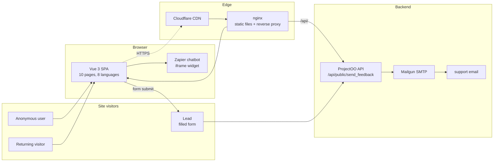
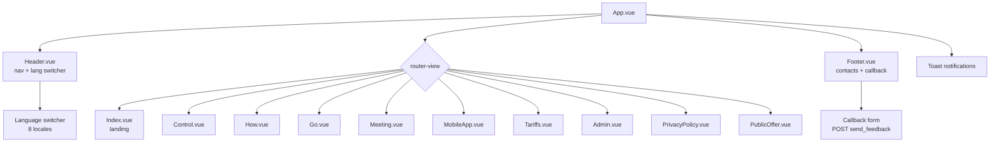
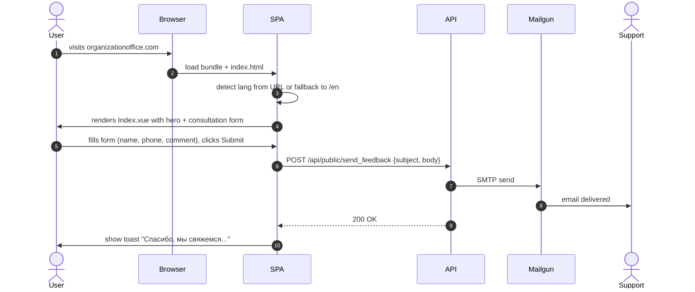
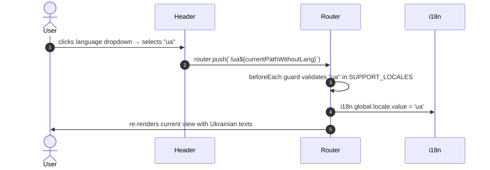
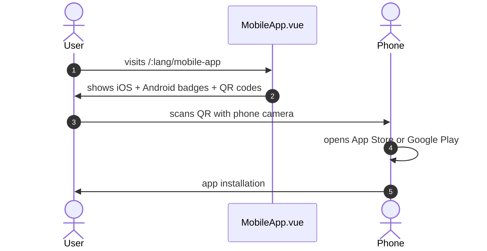
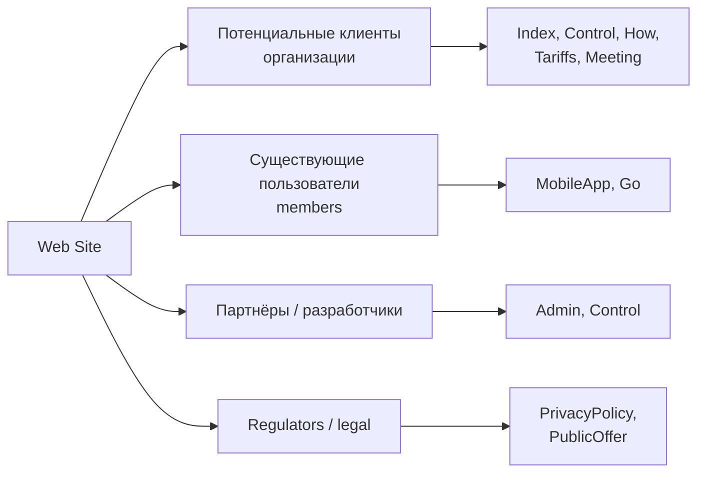
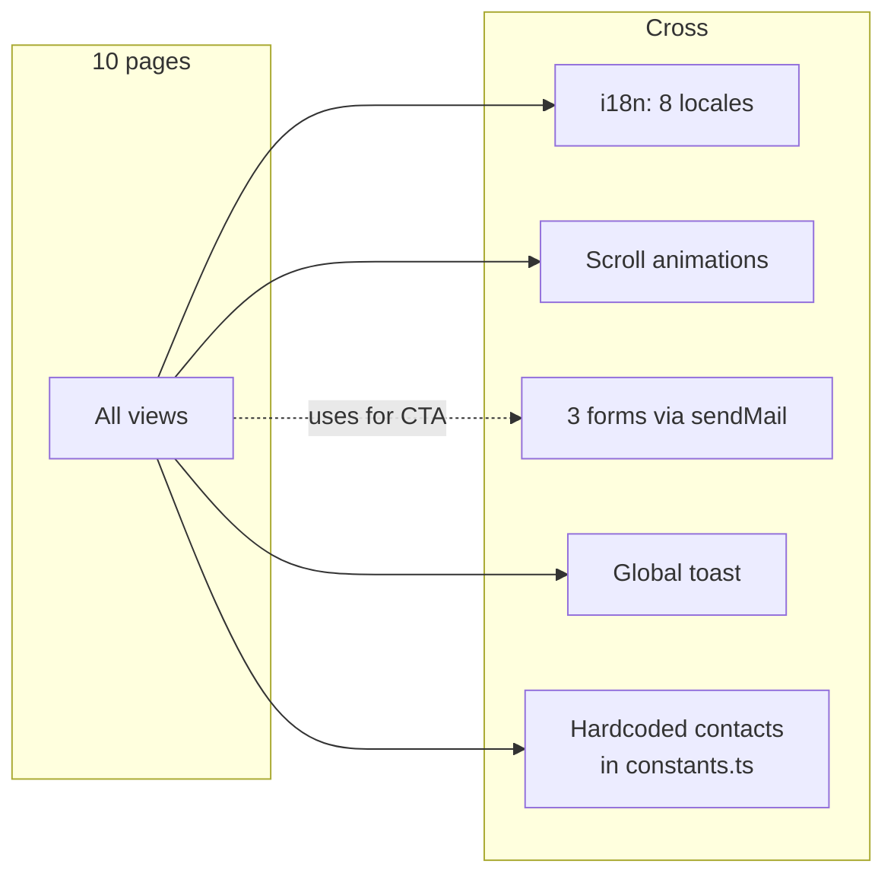
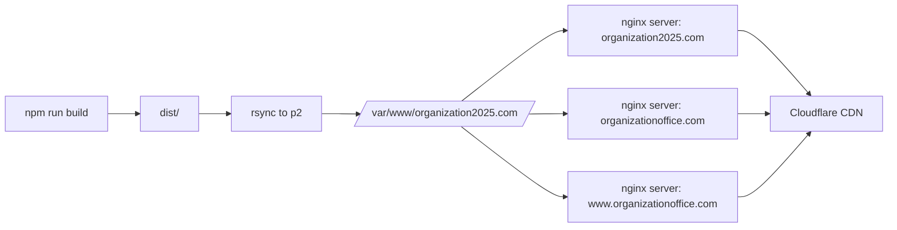

# ProjectOO Web — Functional Specification

Функциональная спецификация публичного сайта-лендинга. Описывает систему с точки зрения **бизнес-функциональности**: какие страницы, какой контент, какие формы.

Формат — box-diagrams + descriptions + roadmap (повторяет стиль спецификаций api и webadmin).

---

## 1. System Main Structure

**Принципы:**
- **No login**: всё доступно без аутентификации
- **No state**: нет cookies / localStorage для UI state
- **Language via URL**: `/:lang/page` — единственный источник правды
- **Static-first**: всё разруливает nginx, backend нужен только для отправки форм
- **Multi-domain**: один build → `organizationoffice.com` + `organization2025.com`

---

## 2. UI Structure

---

## 3. Page Catalogue

| Page | URL | Назначение |
|------|-----|-----------|
| **Index** | `/:lang` | Landing с hero, consultation form, stats, features, testimonials, CTA |
| **Control** | `/:lang/control` | Описание возможностей управления / Board panel |
| **How** | `/:lang/how` | Step-by-step гайд "How it works" |
| **Go** | `/:lang/go` | Onboarding / Getting started |
| **Meeting** | `/:lang/meeting` | Описание возможностей online-встреч |
| **MobileApp** | `/:lang/mobile-app` | Промо мобильного приложения (iOS + Android, QR-коды) |
| **Tariffs** | `/:lang/tariffs` | Тарифные планы / pricing |
| **Admin** | `/:lang/admin` | Описание админ-возможностей (для потенциальных орг-админов) |
| **PrivacyPolicy** | `/:lang/privacy-policy` | Политика конфиденциальности (юридический текст) |
| **PublicOffer** | `/:lang/public-offer` | Публичная оферта / Terms of Service |

Детали по каждой — [specs/pages.md](specs/pages.md).

---

## 4. Module Catalogue

| Модуль | Что | Spec |
|--------|-----|------|
| **Pages** | 10 view-страниц с описаниями | [specs/pages.md](specs/pages.md) |
| **Routing** | Language-prefix роутинг + guards | [specs/routing.md](specs/routing.md) |
| **i18n** | 8 локалей через vue-i18n | [specs/i18n.md](specs/i18n.md) |
| **Forms** | 3 формы (callback, consultation, admin) | [specs/forms.md](specs/forms.md) |
| **API Integration** | axios + send_feedback endpoint | [specs/api-integration.md](specs/api-integration.md) |
| **SEO & PWA** | Manifest, favicons, sitemap | [specs/seo-pwa.md](specs/seo-pwa.md) |
| **Assets** | Images, SVG icons, fonts | [specs/assets.md](specs/assets.md) |

---

## 5. User Flows

### Flow 1: Anonymous visitor lands → fills consultation form

### Flow 2: User switches language

### Flow 3: Mobile app promotion → QR scan → app install

---

## 6. Content Strategy

Сайт обслуживает 4 аудитории:

---

## 7. Cross-cutting

---

## 8. Roadmap

| Год | Stage | Описание |
|-----|-------|---------|
| **2025** | **STAGE 0: Quality** | Включить TypeScript strict mode, добавить `npm run lint`, добавить Vitest unit-тесты |
| **2025** | **STAGE 1: SEO foundation** | `@unhead/vue` для динамических meta-тегов per page, sitemap.xml generation в build pipeline, robots.txt с правильными правилами |
| **2026** | **STAGE 2: Performance** | Lazy-load 8 lang JSON (только current locale), route-based code splitting, image optimization (WebP/AVIF), preconnect/preload critical resources |
| **2026** | **STAGE 3: Accessibility** | WCAG 2.1 AA compliance: alt-тексты, ARIA labels, focus management, RTL для арабского |
| **2027** | **STAGE 4: SSR / SSG** | Переход на Nuxt 3 или Vite SSG для лучшего SEO (особенно важно для маркетингового сайта) |
| **2027** | **STAGE 5: PWA enhanced** | Service worker для offline, push notifications для уведомлений новостей |
| **2028** | **STAGE 6: A/B testing** | Интеграция с Optimizely / Google Optimize для оптимизации conversion на формах |
| **2029** | **STAGE 7: CMS** | Перенести контент из `lang/*.json` в headless CMS (Strapi / Sanity) для редактирования без коммита |

### Known issues (немедленные)

| Severity | Issue | Где | Митигация |
|----------|-------|-----|-----------|
| 🟠 HIGH | `<html lang="ua">` хардкодом | `index.html` | менять динамически по current locale |
| 🟠 HIGH | Нет SEO meta-тегов per page | `views/*` | `@unhead/vue` |
| 🟡 MEDIUM | Все 8 lang JSON в bundle | `service/i18n.ts` | dynamic import |
| 🟡 MEDIUM | Нет sitemap.xml | build | vite-plugin-sitemap |
| 🟡 MEDIUM | Нет robots.txt в `public/` | `public/` | добавить |
| 🟡 MEDIUM | RTL для арабского не настроен | App.vue / style.scss | `dir="rtl"` + CSS-вариант |
| 🟡 MEDIUM | Zapier chatbot sync-loads на любой странице | `index.html` | defer / условная загрузка |
| 🟢 LOW | `strict: false` в tsconfig | tsconfig | постепенно strict |
| 🟢 LOW | Нет unit-тестов | — | Vitest |
| 🟢 LOW | Нет `lint` script в package.json | — | добавить |

---

## 9. Domains & Deployment

Один build = 3 (и more, если добавятся) домена. Никаких per-domain branding пока не реализовано.

---

## См. также

- [README.md](../README.md) — entry point
- [ARCHITECTURE.md](ARCHITECTURE.md) — техническая архитектура
- [SETUP.md](SETUP.md) — локальная настройка и деплой
- [CONTENT-GUIDE.md](CONTENT-GUIDE.md) — как редактировать контент
- [specs/](specs/) — модульные спеки
