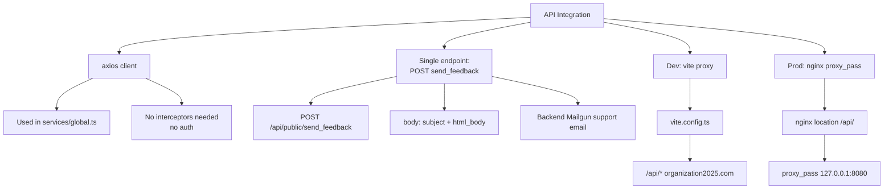

# API Integration — Functional Spec

Минимальная интеграция: один endpoint для форм + проксирование статики через nginx.

## Structure



## Functional Description

### axios usage

В отличие от `webadmin`, здесь нет глобального `api` instance — `axios.post(...)` вызывается напрямую в `services/global.ts`:

```ts
import axios from 'axios'

export async function sendMail(payload) {
  try {
    await axios.post('/api/public/send_feedback', {
      subject: payload.subject,
      body: payload.body
    })
    showToast(i18n.global.t('email.success'))
    return true
  } catch (e) {
    showToast(i18n.global.t('email.error'))
    return false
  }
}
```

Нет authentication, нет interceptor — endpoint публичный.

### The only endpoint

`POST /api/public/send_feedback` — единственный, который сайт использует.

**Request:**
```json
{
  "subject": "Callback request",
  "body": "<h2>...</h2><p>Name: ...</p>"
}
```

**Response:** 200 OK на успех, 4xx/5xx на ошибку.

### Backend implementation

См. [api/docs/specs/integrations.md](../../../api/docs/specs/integrations.md). Кратко:
- Spring Boot контроллер `PublicController.send_feedback`
- Использует `VerificationService.sendFeedback`
- Отправляет через JavaMailSender (Mailgun SMTP)
- Адрес назначения — `spring.mail.support` (`support@organizationoffice.com`)

### Dev proxy (vite.config.ts)

```ts
server: {
  proxy: {
    '/api': {
      target: 'https://organization2025.com',
      changeOrigin: true
    }
  }
}
```

В dev все `/api/*` идут на продакшен бэкенд. Для разработки против локального API — поменять target на `http://localhost:8080`.

### Production routing

nginx:
```nginx
location /api/ {
    proxy_pass http://127.0.0.1:8080/;
    proxy_set_header Host $host;
}
```

Тот же бэкенд (Spring Boot на 8080) обслуживает и webadmin, и mobile API, и формы публичного сайта.

### XML data: /public/xml/rgo.xml

Файл с публичными реестровыми данными общественных организаций (Украина). Не загружается через API — это статика, парсится клиентом через fast-xml-parser:

```ts
import { XMLParser } from 'fast-xml-parser'

const response = await fetch('/xml/rgo.xml')
const text = await response.text()
const data = new XMLParser().parse(text)
```

Если используется в одном-двух местах — стоит lazy-load.

### Static assets

Все из public/ раздаются nginx как статика: img/, svg/, xml/, favicons, manifest. В browser cache живут долго.

## CORS

Не нужен — same-origin в prod. В dev vite proxy маскирует cross-origin.

## Error handling

`sendMail` — try/catch + generic toast. Backend message игнорируется на frontend; пользователь видит generic "Something went wrong".

## Permissions

Endpoint публичный — без JWT. Backend должен иметь rate-limiting per IP + опционально honeypot/CAPTCHA на форме.

## Known gaps

- No request idempotency — повторный submit отправит email повторно
- No retry logic — single attempt
- Generic errors only — не показываем server-side message
- No timeout — axios default (нет timeout вообще)
- No request cancellation при unmount компонента
- No analytics на API-вызовы
