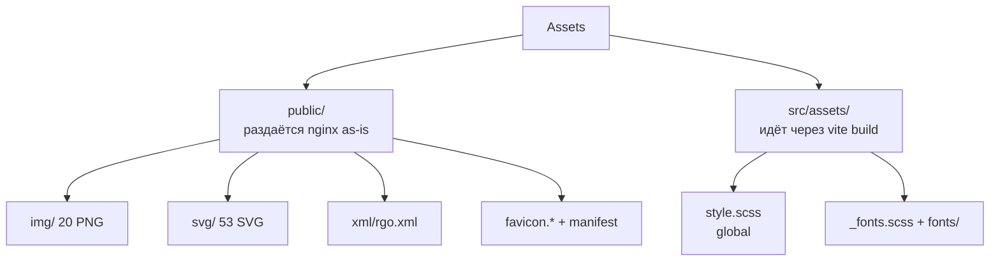

# Assets — Functional Spec

Изображения, иконки, шрифты, стили.

## Structure



## public/ — раздаётся nginx as-is

### public/img/ — PNG картинки (20 файлов)

| Категория | Файлы | Назначение |
|-----------|-------|-----------|
| **Hero images** | `index_1_1.png`, `control_1_1.png`, `meeting_1_1.png`, `mobile-app_1_1.png` | Большие картинки в первом блоке (s_1) каждой страницы |
| **Feature blocks** | `control_4_1.png`, `control_5_1.png`, `control_6_1.png`, `control_7_1.png`, `index_4_1.png`, `index_5_1.png`, `index_6_1.png`, `meeting_4_1.png`, `mobile-app_2_1.png` | Иллюстрации внутри секций |
| **Team** | `team_1.png` .. `team_7.png` | 7 портретов команды (вероятно на Index или About) |

Соглашение по именам: `<page>_<section>_<index>.png`.

Формат — PNG. **Roadmap**: миграция на WebP / AVIF (экономит 30-50% размера).

### public/svg/ — Иконки и декор (53 файла)

#### Brand
- `logo.svg`, `logo-sm.svg` — главный логотип + small variant

#### Social media (по 2 варианта — для dark и white backgrounds)
- Instagram: `in.svg`, `in-w.svg`
- YouTube: `you.svg`, `you-w.svg`, `you-b.svg`
- TikTok: `tt.svg`, `tt-w.svg`
- Telegram: `tg.svg`, `tg-b.svg`
- Facebook: `f.svg`, `f-w.svg`
- WhatsApp: `wa.svg`, `wa-w.svg`
- LinkedIn: `linkedin.svg`, `linkedin-w.svg`

#### App stores
- `apple.svg`, `apple-w.svg` — App Store
- `googleplay.svg` — Google Play

#### UI icons (descriptive names)
- `check.svg`, `check-2.svg`, `check-3.svg` — checkmarks (3 варианта)
- `arrow-right.svg`, `arrow-right-2.svg`, `arrow-right-3.svg` — стрелки
- `like.svg`, `click.svg`, `download.svg`, `accept.svg`
- `communication.svg`, `customer.svg`, `users.svg`
- `documents.svg`, `file.svg`, `registration-form.svg`
- `video-call.svg`, `online-meeting.svg`
- `hash.svg`, `list-search.svg`

#### Decorative
- `triangle.svg`, `triangle-2.svg`, `triangle-3.svg` — геометрические формы
- `bg-1.svg`, `bg-2.svg`, `bg-3.svg`, `bg-4.svg` — background patterns
- `chat-qr.svg`, `qr2.svg` — QR-коды (вероятно для Telegram и mobile app)

**Соглашение**: `-w` суффикс = white version, `-b` = black/blue.

### public/xml/

- `rgo.xml` — Public org registry data (Україна, Реєстр громадських об'єднань). Парсится через `fast-xml-parser` если используется (нужно проверить, где именно).

### public/ — favicons & PWA

| Файл | Размер | Назначение |
|------|--------|-----------|
| `favicon.ico` | 15 KB | Legacy browsers |
| `favicon.svg` | scalable | Modern, supports theming |
| `favicon-96x96.png` | 96×96 | Standard PNG |
| `apple-touch-icon.png` | 180×180 | iOS home screen |
| `web-app-manifest-192x192.png` | 192×192 | PWA Android |
| `web-app-manifest-512x512.png` | 512×512 | PWA splash |
| `site.webmanifest` | — | PWA manifest |

## src/assets/ — обрабатывается vite

### style.scss

Главный стиль (импортируется в `main.ts`). Содержит:

#### Цветовая палитра

```scss
// Backgrounds
$bg-main:      #DBD6DE;  // светло-фиолетовый — главный фон
$bg-secondary: white;
$bg-2:         #2E80B7;  // синий акцент
$bg-3:         black;
$bg-4, $bg-5, $bg-6, $bg-7, $bg-8: #...; // pastel variations

// Text colors
$text-main, $text-light, $text-accent, $text-dark
```

#### Глобальные resets

`* { box-sizing: border-box; }`, нормализация margin/padding, font-family.

#### Utility classes

Flex utilities (`.flex`, `.flex-center`, `.flex-between`), spacing (`.mt-4`, `.p-8`), text alignment, shadows, transitions, animation keyframes (для scroll-reveal).

### _fonts.scss

`@font-face` декларации для **Roboto Condensed** (3 веса: Regular, Medium, Bold).

```scss
@font-face {
  font-family: 'Roboto Condensed';
  src: url('./fonts/RobotoCondensed/RobotoCondensed-Regular.ttf') format('truetype');
  font-weight: 400;
  font-display: swap;
}
// + Medium (500) и Bold (700)
```

### fonts/RobotoCondensed/

TTF файлы шрифтов:
- `RobotoCondensed-Regular.ttf`
- `RobotoCondensed-Medium.ttf`
- `RobotoCondensed-Bold.ttf`

> **Roadmap**: конвертировать в WOFF2 (10x меньше, поддерживается всеми современными браузерами). Использовать `font-display: swap` для perf.

## Asset pipeline differences

### public/ vs src/assets/

| Источник | Обработка | URL в production |
|----------|----------|-------------------|
| `public/img/foo.png` | копируется в `dist/` as-is | `/img/foo.png` |
| `public/svg/logo.svg` | копируется в `dist/` as-is | `/svg/logo.svg` |
| `src/assets/bg.png` (если был бы) | hash-suffixed, бандлится | `/assets/bg-a1b2c3d4.png` |
| `src/assets/style.scss` | компилируется в CSS | `/assets/index-xyz.css` |

**Правило**: статика, которая ссылается напрямую через URL (``) — в `public/`. Стили и шрифты, которые импортируются через `import './style.scss'` — в `src/assets/`.

## CDN / caching

В production раздаются через nginx → Cloudflare CDN. Cache-Control headers должны быть:
- HTML / SPA index — `Cache-Control: no-cache` (всегда свежий)
- JS/CSS с hash в имени — `Cache-Control: max-age=31536000, immutable` (год)
- Images/SVG — `Cache-Control: max-age=2592000` (месяц)
- favicons / manifest — `Cache-Control: max-age=2592000`

> Конфиг для nginx нужно проверить — может быть default.

## Optimization checklist

- [ ] PNG → WebP/AVIF (через `npx @squoosh/cli` или image-min плагин для vite)
- [ ] SVG минимизированы (через [SVGOMG](https://jakearchibald.github.io/svgomg/))
- [ ] TTF → WOFF2 для шрифтов
- [ ] `font-display: swap` чтобы текст показывался сразу
- [ ] Critical CSS inline в `<head>` (vite-plugin-html-inline)
- [ ] Lazy-load для below-the-fold images (`loading="lazy"`)
- [ ] Preconnect для CDN / Zapier

## Known gaps

- PNG не оптимизированы / не сконвертированы в WebP
- SVG могут содержать metadata (Inkscape, Illustrator) — экономия 10-30% после оптимизации
- Шрифты в TTF (не WOFF2) — лишний download size
- Нет proactive preload для критических ресурсов
- Нет responsive images (`<picture>` + multiple sizes)
