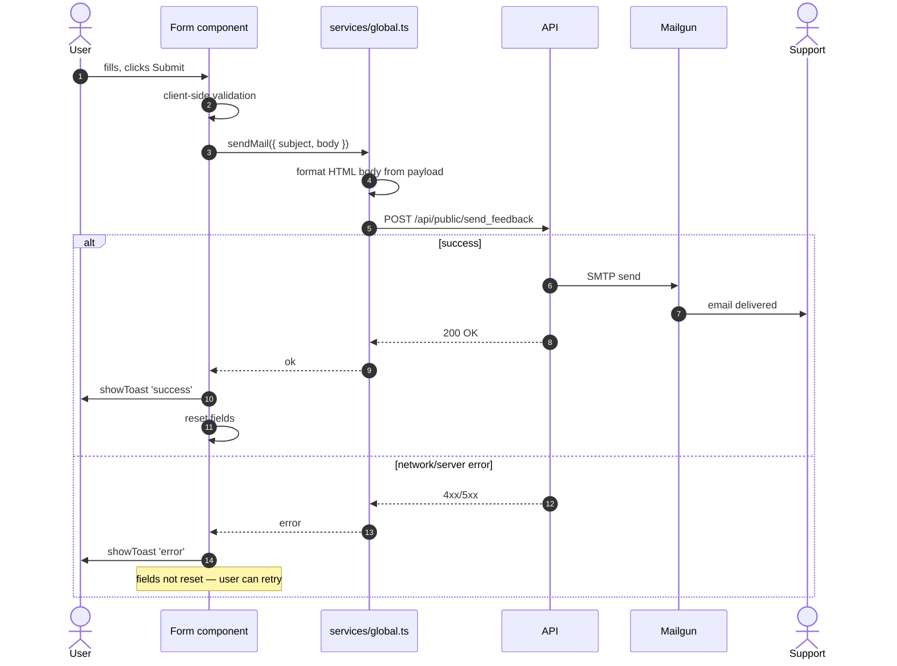

# Forms — Functional Spec

3 формы обратной связи на сайте — все отправляют через единый endpoint `/api/public/send_feedback`.

## Structure

```mermaid
flowchart TB
    Forms[Forms]

    Forms --> CB[Callback form]
    Forms --> Cons[Consultation form]
    Forms --> Adm[Admin access form]

    CB --> CB1[Footer.vue]
    CB --> CB2[Subject: callback]
    CB --> CB3[Fields: name, phone]

    Cons --> Con1[Index.vue hero/CTA]
    Cons --> Con2[Subject: consultation]
    Cons --> Con3[Fields: name, phone, email,<br/>org name, comment]

    Adm --> Adm1[Admin.vue]
    Adm --> Adm2[Subject: admin_access]
    Adm --> Adm3[Fields: org name, contact,<br/>justification]

    CB --> Send[sendMail in global.ts]
    Cons --> Send
    Adm --> Send
    Send --> API[POST /api/public/send_feedback]
    API --> Mail[Mailgun SMTP]
    Mail --> Support[support@organizationoffice.com]
```

## Functional Description

### Callback form (Footer.vue)

Мини-форма в footer'е, доступна со всех страниц.

| Поле | Required | Validation |
|------|:--------:|-----------|
| Name | ✅ | non-empty |
| Phone | ✅ | not-strict format |

Submit → toast "Спасибо, мы свяжемся с вами" → reset формы.

### Consultation form (Index.vue)

Основная форма на лендинге — для запроса демо/консультации.

| Поле | Required | Validation |
|------|:--------:|-----------|
| Name | ✅ | non-empty |
| Phone | ✅ | not-strict |
| Email | optional | RFC email if filled |
| Organization name | optional | non-empty if filled |
| Message / comment | optional | textarea |

### Admin access form (Admin.vue)

Для существующих администраторов организаций, потерявших доступ или запрашивающих расширенные права.

| Поле | Required | Validation |
|------|:--------:|-----------|
| Organization name | ✅ | non-empty |
| Contact name | ✅ | non-empty |
| Contact email/phone | ✅ | non-empty |
| Justification / details | ✅ | textarea |

## Submission flow



## sendMail() — глобальный helper

`src/service/global.ts`:

```ts
import axios from 'axios'
import i18n from '@/service/i18n'

export async function sendMail(payload: {
  subject: string
  body: string
  // или: name, phone, email, comment — формат уточняется
}) {
  try {
    await axios.post('/api/public/send_feedback', payload)
    showToast(i18n.global.t('email.success'), 'success')
    return true
  } catch (error) {
    showToast(i18n.global.t('email.error'), 'error')
    return false
  }
}
```

Регистрируется как global property в `main.ts`:
```ts
app.config.globalProperties.$sendMail = sendMail
```

Использование в компонентах: `this.$sendMail({ subject, body })`.

## Email body format

Backend получает в payload поле `body` с HTML-форматированным содержимым формы. Пример:

```html
<h2>Callback request</h2>
<p><b>Name:</b> Іван Петренко</p>
<p><b>Phone:</b> +380501234567</p>
<p><b>Submitted at:</b> 2025-10-15 14:30 UTC</p>
<p><b>Source:</b> https://organizationoffice.com/ua</p>
```

Backend (`VerificationService.sendFeedback`) пересылает на `spring.mail.support` (= `support@organizationoffice.com`).

## Anti-spam

**Сейчас**: на сайте нет CAPTCHA / honeypot / rate-limiting на стороне frontend. Backend должен иметь:
- Rate limit per IP (например, ≤5 запросов/минуту на `/api/public/send_feedback`)
- Опционально — honeypot field (hidden field, который боты заполняют, а humans — нет)
- Опционально — Cloudflare Turnstile (бесплатная альтернатива reCAPTCHA)

> Roadmap: добавить honeypot + Turnstile, см. SPECIFICATION.md STAGE 1.

## Validation

Client-side: minimal — required check + phone format hint. **НЕ** strict validation (например, не используется `vee-validate`).

Server-side: бэкенд должен sanitize/validate (особенно для HTML в body — XSS-риск при пересылке email).

## i18n

Тексты форм (labels, placeholders, button labels, error/success messages) хранятся в `lang/*.json` под ключами `email.*`:

```json
{
  "email": {
    "subject_callback": "Callback request",
    "subject_consultation": "Consultation request",
    "subject_admin": "Admin access request",
    "success": "Thank you! We will contact you within 24 hours.",
    "error": "Something went wrong. Please try again or call us directly.",
    "field_name": "Name",
    "field_phone": "Phone",
    "field_email": "Email",
    "field_org": "Organization",
    "field_comment": "Comment",
    "btn_submit": "Submit"
  }
}
```

## Known gaps

- **Нет CAPTCHA / honeypot** — формы открыты для ботов
- **Client-side validation минимальная** — нет инлайн-ошибок per-field
- **`sendMail` не показывает loading state** — пользователь может кликнуть Submit многократно
- **Нет idempotency** — повторный submit отправит email ещё раз
- **Нет form analytics** (например, какая % submissions vs visits)
- **Backend error sanitization**: если backend возвращает error message, он не локализован — на frontend всегда `email.error` (generic).
