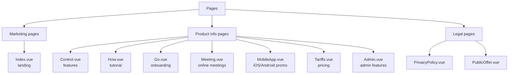

# Pages — Functional Spec

10 view-страниц в `src/views/`. Все рутятся через `:lang` prefix.

## Structure

## Functional Description

### Index.vue — Landing

Главная страница, URL `/:lang`.

Структура (typical sections):
- **s_1**: Hero block — заголовок, подзаголовок, CTA, hero-картинка (`/img/index_1_1.png`)
- **s_2**: Stats — KPI с animated count-up
- **s_3**: Trust block — testimonials / партнёры
- **s_4**: Features grid — основные возможности
- **s_5**: How it works (compact)
- **s_6**: CTA + consultation form

Translation keys: `$t('index.s_1.title')`, `$t('index.s_4_1.text')` etc.

### Control.vue — Board / Management

URL `/:lang/control`. Описание возможностей управления:
- Управление членами организации
- Документооборот
- Контроль финансов
- Голосования

Картинки: `/img/control_1_1.png`, `/img/control_4_1.png`, ... `/img/control_7_1.png`.

### How.vue — Tutorial

URL `/:lang/how`. Step-by-step гайд "Как это работает":
1. Регистрация
2. Настройка организации
3. Добавление членов
4. Запуск процессов
5. Аналитика

### Go.vue — Getting Started

URL `/:lang/go`. Onboarding — что делать сразу после регистрации.

Может включать:
- Чек-лист первых шагов
- Demo-видео
- Контакты команды поддержки

### Meeting.vue — Online Meetings

URL `/:lang/meeting`. Описание функционала встреч:
- Видеоконференции (если есть)
- Электронная повестка
- Голосование с ЕЦП (через Diia)
- Протоколы

Картинки: `/img/meeting_1_1.png`, `/img/meeting_4_1.png`.

### MobileApp.vue — Mobile App Promotion

URL `/:lang/mobile-app`. Реклама мобильного приложения:
- App Store + Google Play badges (через `APPS` из `constants.ts`)
- QR-коды (`/svg/qr2.svg`, `/svg/chat-qr.svg`)
- Screenshot'ы (`/img/mobile-app_1_1.png`, `mobile-app_2_1.png`)
- Список ключевых features

### Tariffs.vue — Pricing

URL `/:lang/tariffs`. Тарифные планы.

Структура:
- Tier cards (Basic / Advanced / Premium / Enterprise)
- Каждая карточка: name, price, features list, CTA-кнопка
- Optional: FAQ внизу

Возможно есть form запроса для Enterprise (через `sendMail`).

### Admin.vue — Admin Features

URL `/:lang/admin`. Описание возможностей для администраторов организаций.

Может включать форму запроса доступа к админ-панели (для существующих организаций) — через `sendMail`.

### PrivacyPolicy.vue — Privacy Policy

URL `/:lang/privacy-policy`. Юридический текст политики конфиденциальности.

Обычно длинный плоский текст с заголовками — HTML-разметка прямо в template или через `v-html` с переводами.

### PublicOffer.vue — Terms of Service

URL `/:lang/public-offer`. Публичная оферта (украинский контекст: SPA agreement).

Аналогично PrivacyPolicy — большой текст с разделами.

## Common page elements

Все страницы (кроме `PrivacyPolicy` / `PublicOffer`) используют:

- **Scroll animations** через `scrollAnimate()` — секции появляются при scroll'е
- **Responsive layout** — mobile-first через SCSS media queries
- **Lazy load images** (через native `loading="lazy"` на ``)
- **CTA buttons** ведут на формы (Footer callback или page-specific consultation)

## Section indexing convention

Внутри каждой страницы секции нумеруются: `s_1`, `s_2`, ... `s_N`. Для блоков внутри секции — `s_N_1`, `s_N_2`. Это удобно для:
- Перевода (легко найти "что это")
- Backend-debug (легко сопоставить URL с переводом)

## Pages without translation keys

`PrivacyPolicy.vue` и `PublicOffer.vue` могут содержать большие куски HTML inline (потому что юр.тексты не требуют интерактивных элементов). Перевод этих документов — отдельный workflow (часто с юристами).

## Known gaps

- **SEO meta-теги per page**: сейчас нет — только глобальный title в `index.html`. Нужно `@unhead/vue` для per-page `<title>` и `<meta description>`.
- **Hero images** для `PrivacyPolicy` / `PublicOffer` отсутствуют → используется generic layout.
- **404 page**: не определена явно — router fallback'ает на `/en`.
- **Performance**: hero-картинки PNG ~200-400 KB каждая → WebP/AVIF сэкономит ~50%.
