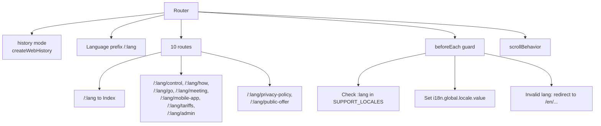

# Routing — Functional Spec

## Structure



## Functional Description

### Mode

`createWebHistory()` — без hash в URL (`/en/control`, не `/#/en/control`). Требует nginx `try_files $uri /index.html;` для fallback.

### Language prefix strategy

Все routes начинаются с `:lang` параметра:

```ts
const routes: RouteRecordRaw[] = [
  { path: '/:lang', name: 'index', component: Index },
  { path: '/:lang/control', name: 'control', component: Control },
  { path: '/:lang/how', name: 'how', component: How },
  { path: '/:lang/go', name: 'go', component: Go },
  { path: '/:lang/meeting', name: 'meeting', component: Meeting },
  { path: '/:lang/mobile-app', name: 'mobile-app', component: MobileApp },
  { path: '/:lang/tariffs', name: 'tariffs', component: Tariffs },
  { path: '/:lang/admin', name: 'admin', component: Admin },
  { path: '/:lang/privacy-policy', name: 'privacy', component: PrivacyPolicy },
  { path: '/:lang/public-offer', name: 'offer', component: PublicOffer },
]
```

### beforeEach guard

```ts
router.beforeEach((to, from, next) => {
  const lang = to.params.lang as string

  if (!SUPPORT_LOCALES.includes(lang)) {
    // Redirect to default English version of the same path
    const newPath = `/en${to.path.replace(`/${lang}`, '') || ''}`
    next({ path: newPath })
    return
  }

  // Sync i18n with route lang
  i18n.global.locale.value = lang
  next()
})
```

**Что происходит:**
- `/ua/control` → `ua` ∈ SUPPORT_LOCALES → i18n.locale = 'ua', render Control
- `/ru/control` → `ru` ∉ SUPPORT_LOCALES → redirect to `/en/control`
- `/control` (без lang) → match `/:lang/control` где `:lang = 'control'`? **Это не сматчится правильно**, нужно проверить fallback

> Edge case: что если пользователь зашёл на корень `/` без lang? Router должен redirect на `/en` или дефолт.

### scrollBehavior

```ts
const router = createRouter({
  // ...
  scrollBehavior(to, from, savedPosition) {
    if (savedPosition) return savedPosition  // back/forward → restore
    if (to.hash) return { el: to.hash, behavior: 'smooth' }  // hash anchor
    return { top: 0 }  // default top
  }
})
```

### URL examples

| URL | Page | Lang |
|-----|------|------|
| `/en` | Index | English |
| `/ua` | Index | Ukrainian |
| `/ua/control` | Control | Ukrainian |
| `/de/tariffs` | Tariffs | German |
| `/ar/mobile-app` | MobileApp | Arabic |
| `/fr/privacy-policy` | PrivacyPolicy | French |

### Internal links

В компонентах ссылки строятся динамически с текущим locale:

```vue
<router-link :to="`/${$i18n.locale}/control`">
  {{ $t('header.nav1.control') }}
</router-link>
```

Это значит: при смене языка через language switcher все internal-ссылки автоматически перерисовываются с новым prefix.

### Language switch implementation

`Header.vue`:
```ts
function changeLanguage(newLang: string) {
  const currentPath = route.path.replace(`/${route.params.lang}`, '')
  router.push(`/${newLang}${currentPath || ''}`)
}
```

Логика: вырезать старый lang из URL, подставить новый. View пересоздаётся, i18n переключается через guard.

## Permissions

Все страницы — публичные, без auth. Любой visitor может зайти на любую страницу.

## Known gaps

- **Корневой `/`** (без lang): не определено четко поведение. Должно redirect на `/en` или на browser locale.
- **404 page**: нет catch-all route. Несуществующая страница в supported lang (например `/en/nonexistent`) → router показывает blank или фейлит.
  ```ts
  // Должно быть:
  { path: '/:lang/:pathMatch(.*)*', component: NotFound }
  ```
- **Browser language detection**: при первом визите не пытаемся определить язык из `navigator.language` — все redirect'ятся на `/en`.
- **Canonical URLs**: для SEO нужны `<link rel="canonical">` и `<link rel="alternate" hreflang="...">` per language (через `@unhead/vue`).
