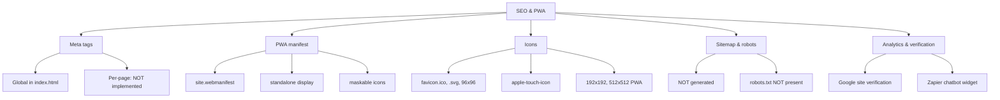

# SEO & PWA — Functional Spec

## Structure



## Functional Description

### Global meta tags (index.html)

```html
<!doctype html>
<html lang="ua">  <!-- 🟠 hardcoded — should be dynamic -->
<head>
  <meta charset="UTF-8">
  <meta http-equiv="X-UA-Compatible" content="IE=edge">
  <meta name="viewport" content="width=device-width, initial-scale=1.0">
  <link rel="icon" type="image/svg+xml" href="/favicon.svg">
  <link rel="icon" type="image/png" sizes="96x96" href="/favicon-96x96.png">
  <link rel="apple-touch-icon" sizes="180x180" href="/apple-touch-icon.png">
  <link rel="manifest" href="/site.webmanifest">
  <meta name="google-site-verification" content="...">
  <title>Organization2025</title>
</head>
```

**Текущее состояние:**
- ✅ Charset / viewport / favicons / manifest
- ✅ Google site verification
- 🟠 `<html lang="ua">` хардкодом → не синхронизировано с current locale
- ❌ Per-page `<title>` — везде одинаковый "Organization2025"
- ❌ `<meta name="description">` — отсутствует
- ❌ Open Graph / Twitter Card meta — отсутствует (плохое preview при шеринге в соцсетях)
- ❌ `<link rel="canonical">` — нет (плохо для duplicate-content)
- ❌ `<link rel="alternate" hreflang="...">` — нет (для multi-language SEO)

### PWA Manifest (site.webmanifest)

```json
{
  "name": "MyWebSite",
  "short_name": "MySite",
  "icons": [
    {
      "src": "/web-app-manifest-192x192.png",
      "sizes": "192x192",
      "type": "image/png",
      "purpose": "maskable"
    },
    {
      "src": "/web-app-manifest-512x512.png",
      "sizes": "512x512",
      "type": "image/png",
      "purpose": "maskable"
    }
  ],
  "theme_color": "#ffffff",
  "background_color": "#ffffff",
  "display": "standalone"
}
```

**🟡 Issues:**
- Имя `"MyWebSite"` / `"MySite"` — placeholder. Должно быть "OrganizationOffice" или "Organization2025"
- Нет `start_url` (по умолчанию `/`)
- Нет `scope` (по умолчанию домен origin'а)
- Нет `description`
- Нет `lang`
- Нет `categories` (для discovery в PWA stores)
- `purpose: maskable` правильно, но желательно добавить `any` версию (для устройств без masking)

### Favicons

| Файл | Размер | Назначение |
|------|--------|-----------|
| `favicon.ico` | 15 KB | Legacy browsers |
| `favicon.svg` | scalable | Modern browsers (auto-scaling) |
| `favicon-96x96.png` | 96×96 | Standard PNG |
| `apple-touch-icon.png` | 180×180 | iOS Safari "Add to home" |
| `web-app-manifest-192x192.png` | 192×192 | PWA install icon (Android) |
| `web-app-manifest-512x512.png` | 512×512 | PWA splash / large icon |

Полный комплект. При смене брендинга нужно перегенерировать всё (через [realfavicongenerator.net](https://realfavicongenerator.net)).

### Sitemap

❌ **НЕТ** — `sitemap.xml` не генерируется и не лежит в `public/`.

Должен быть для:
- Submission в Google Search Console
- Crawl-friendly навигация по всем 10 страницам × 8 языков = 80 URL

**Решение:** vite plugin типа [vite-plugin-sitemap](https://github.com/jbaubree/vite-plugin-sitemap):

```ts
// vite.config.ts
import Sitemap from 'vite-plugin-sitemap'

export default defineConfig({
  plugins: [
    vue(),
    Sitemap({
      hostname: 'https://organizationoffice.com',
      dynamicRoutes: [
        '/en', '/en/control', '/en/how', /* ... */,
        '/ua', '/ua/control', /* ... */,
        // ... × 8 locales × 10 pages = 80 URLs
      ]
    })
  ]
})
```

Получим `dist/sitemap.xml` при build.

### robots.txt

❌ **НЕТ** в `public/`.

Должен быть (минимум):
```
User-agent: *
Allow: /
Disallow: /api/

Sitemap: https://organizationoffice.com/sitemap.xml
```

### Open Graph / Twitter Card

❌ **НЕТ**. Когда ссылка на сайт шарится в Telegram / Facebook / Twitter — preview без картинки и описания.

Должно быть (per page, через `@unhead/vue`):
```html
<meta property="og:title" content="OrganizationOffice — Manage your community">
<meta property="og:description" content="...">
<meta property="og:image" content="https://organizationoffice.com/img/index_1_1.png">
<meta property="og:url" content="https://organizationoffice.com/en">
<meta property="og:type" content="website">

<meta name="twitter:card" content="summary_large_image">
<meta name="twitter:title" content="...">
<meta name="twitter:image" content="...">
```

### Google Site Verification

✅ Присутствует в `index.html`:
```html
<meta name="google-site-verification" content="...">
```

Это значит — сайт уже в Google Search Console. Имеет смысл периодически проверять там Coverage / Issues.

### Zapier Chatbot widget

```html
<zapier-interfaces-chatbot-embed chatbot-id="cmftsrve4001a10558q2960z1"></zapier-interfaces-chatbot-embed>
```

Скрипт загружается синхронно — добавляет ~100-200 KB JS + ~500 ms к TTI. Альтернативы:
- Lazy-load по интеракции (click on "?" иконку)
- Defer (`defer` attribute или dynamic `<script>` insertion после `DOMContentLoaded`)

### Performance budget (proposed)

| Метрика | Target | Текущее (estimate) |
|---------|--------|---------------------|
| Lighthouse Performance | ≥ 90 | ? — нужно проверить |
| LCP | < 2.5s | ? |
| FID | < 100ms | ? |
| CLS | < 0.1 | ? |
| Bundle JS (gzip) | < 200 KB | ~150-200 KB |
| Bundle CSS (gzip) | < 30 KB | ~20-30 KB |
| Total page weight | < 1 MB | ? |

Рекомендация: запустить Lighthouse audit + WebPageTest, добавить в CI.

## Recommended SEO improvements (приоритеты)

1. **`@unhead/vue` для per-page meta** — добавит title, description, OG tags
2. **Sitemap + robots.txt** — basic SEO compliance
3. **Dynamic `<html lang>` + hreflang** — для multi-language SEO
4. **Image optimization** — WebP / AVIF, responsive images через `<picture>`
5. **Lazy-load Zapier widget** — улучшит Lighthouse Performance
6. **SSR / SSG** — переход на Nuxt 3 или vite-ssg даст лучший SEO crawl (для маркетинга это критично)

## Known gaps

- 🟠 PWA manifest имеет placeholder name "MyWebSite"
- 🟠 Нет per-page meta (title, description, OG)
- 🟠 Нет sitemap.xml
- 🟡 Нет robots.txt
- 🟡 Hardcoded `<html lang="ua">`
- 🟡 Нет hreflang для multi-language
- 🟡 Service worker / offline mode не настроен
- 🟢 Zapier chatbot sync-load → 100-200ms TTI penalty
